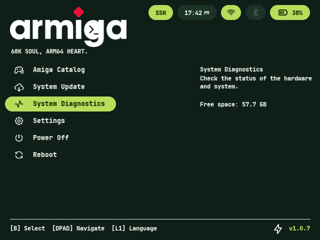
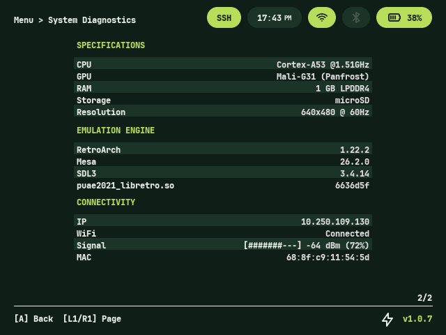
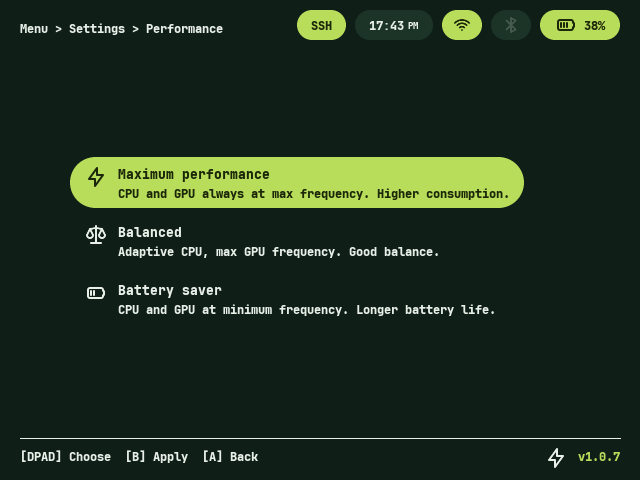

<p align="left">
  <a href="https://github.com/amigagamesplus/armiga/releases"></a>
  <a href="https://github.com/amigagamesplus/armiga/releases"></a>
  <a href="LICENSE"></a>
  
</p>

ARMIGA is a minimal Linux distribution based on **Buildroot** for the **Anbernic RG40XX H** and **RG40XX V**, with experimental support for the **RG35XX H**, developed by retro-gaming enthusiasts. Our goal is to craft a highly focused operating system dedicated to Commodore Amiga emulation via **RetroArch** and the **PUAE core**, creating exactly the retro experience we want while having fun developing it.

<p align="center">
  
  
  
</p>

## Hardware

| Component      | Detail                                          |
| --------------- | ----------------------------------------------- |
| Supported devices | RG40XX H, RG40XX V, RG35XX H (experimental)  |
| SoC             | Allwinner H700 (ARM64, Cortex-A53 x4 @ 1.42GHz, boost to 1.512GHz on Maximum Performance) |
| GPU             | Mali-G31 MP2 (Panfrost)                         |
| RAM             | 1 GB LPDDR4                                     |
| WiFi/BT         | RTL8821CS (SDIO)                                |
| Display         | 640×480                                         |
| Storage         | MicroSD (mmcblk0)                               |

## Current status

### Working components

- ✅ Boot (U-Boot + kernel 7.2.1-armiga + DTB)
- ✅ **A/B** partition scheme with automatic rollback (see below)
- ✅ Rootfs on **SquashFS + zstd** (system/system_b, 300MB per slot, ro)
- ✅ RTL8821CS WiFi (`wpa_supplicant` + `udhcpc`, config generated in `/tmp` — `/etc` is ro)
- ✅ SSH (Dropbear, root, port 22) — enabled by default, toggleable from Settings
- ✅ Dynamic CPU governor: `performance` in normal use, `powersave` during screensaver
- ✅ GPU governor forced to `performance` (fixed 648MHz — `simple_ondemand` didn't scale well under real load)
- ✅ ZRAM swap (512MB, LZ4, `swappiness=100`)
- ✅ `amiga_data` partition (exFAT, auto-expands to 100% of the SD card on first boot)
- ✅ Graphics stack: SDL3 3.4.14 (kmsdrm) + Mesa 26.2.1 (GBM + Panfrost, stripped `.so` in overlay)
- ✅ Custom C/SDL3 launcher (`armiga-launcher`), bilingual **Spanish/English** interface (toggle `L1`, persistent)
- ✅ RetroArch 1.22.2-nightly (tracked commit) + PUAE 2021 core (`puae2021_libretro.so`, build 6636d5f)
- ✅ OTA update system (GitHub Releases → download → SHA256 verification → flash inactive slot, all async without blocking the UI)
- ✅ Automatic A/B rollback on boot failure (attempt counter + slot reversion)
- ✅ Settings menu: wireless network, backup (create/restore/delete), analog stick RGB LEDs, timezone, screensaver, brightness, performance profiles (maximum/balanced/power saving), SSH, factory reset
- ✅ Redesigned "Workbench" interface (beige/gold palette on black, monochrome Tabler Icons iconography)
- ✅ Developer mode (terminal, btop, CPU temperature graph + throttling detection) accessible with `SELECT+START+L1` combo

### Partitions (MBR, never GPT) — A/B scheme

| # | Label       | FS       | Size            | Content                                            | Mount                           |
| --- | ----------- | -------- | --------------- | -------------------------------------------------- | -------------------------------- |
| 1 | boot        | FAT32    | 64 MB           | Kernel, dtb.img, extlinux.conf (armiga-A/B labels) | `/boot` (on demand)              |
| 2 | system      | squashfs | 300 MB          | Rootfs — slot A                                    | `/` (ro) if `DEFAULT=armiga-A`   |
| 3 | system\_b   | squashfs | 300 MB          | Rootfs — slot B (identical copy on every build)    | `/` (ro) if `DEFAULT=armiga-B`   |
| 4 | amiga\_data | exFAT    | rest of the disk | Kickstarts, ROMs, configs, saves                   | `/media/amiga_data`              |

`amiga_data` **must always** be the last physical partition, so that auto-expansion to 100% of the disk works on SD cards of any size.

### Automatic A/B rollback

On boot, `S02bootcheck` compares the active slot (read from `/proc/cmdline`) against an attempt counter persisted on `p1`. If the launcher doesn't confirm a successful boot (first SDL frame rendered) within 3 consecutive attempts, the system automatically reverts `DEFAULT` in `extlinux.conf` to the last known-good slot and reboots — no user intervention required.

### Graphics stack

```
armiga-launcher / RetroArch (PUAE)
    └── SDL3 3.4.14 (backend: kmsdrm)
        ├── libgbm.so.1.0.0 (Mesa 26.2.1)
        │   └── dri_gbm.so → libgallium-26.2.1.so (Panfrost)
        ├── libEGL.so.1.0.0
        ├── libGLESv2.so.2.0.0
        └── libdrm
            └── DRM/KMS kernel (Panfrost, Mali-G31 @ fixed 648MHz)
```
> **Mesa 25+ note:** `panfrost_dri.so` no longer exists. The Panfrost driver lives in `libgallium-<version>.so`, loaded via `dri_gbm.so`. Don't look under `/usr/lib/dri/`.

## Repository structure

```
armiga/
├── .github/workflows/
│   ├── build.yml                      # Main CI — full Buildroot image (manual, points to tag for release)
│   ├── build-kernel.yml               # Kernel CI — Image, dtbs, modules, joypad driver (manual, kernel_version input)
│   ├── build-mesa.yml                 # Mesa CI (cross-compile GBM+Panfrost, committed .so files, manual)
│   ├── build-retroarch.yml            # Stable RetroArch CI (manual)
│   └── build-retroarch-nightly.yml    # Nightly RetroArch CI (manual)
├── board/armiga/
│   ├── bootloader/            # Precompiled kernel, DTB and U-Boot (committed)
│   ├── linux/dts/             # Custom DTS files (rg40xx-h, v2-panel)
│   ├── rootfs_overlay/
│   │   ├── usr/lib/           # Mesa .so files (stripped)
│   │   ├── usr/bin/           # armiga-launcher-wrapper, retroarch (wrapper)
│   │   ├── etc/retroarch/     # retroarch.cfg.template, armiga.cfg, autoconfig/
│   │   ├── etc/init.d/        # Boot scripts (S02bootcheck, S06gpu, S07zram, S40partitions, S41wifi, S43update, ...)
│   │   └── media/amiga_data/  # Static mountpoint (needed: rootfs is ro)
│   ├── post-build.sh          # Generates /etc/armiga-release
│   ├── post-image.sh          # Generates extlinux.conf, amiga_data.img, invokes genimage
│   └── genimage.cfg
├── configs/armiga_defconfig
├── package/
│   ├── sdl3/
│   ├── sdl3_ttf/
│   └── armiga-launcher/       # Custom launcher (C + SDL3)
├── Config.in
├── external.mk
└── external.desc
```

## Build

### Requirements

- Ubuntu 22.04+ (or GitHub Actions)
- Packages: `build-essential wget cpio unzip rsync bc python3 libssl-dev`

### Build on GitHub Actions

Manual trigger (`workflow_dispatch`) in Actions → Build armiga → Run workflow. **Verify that the branch selected in "Use workflow from" is correct** before launching.
Estimated time: 30-40 min (~1h+ if `configs/armiga_defconfig` is modified, which invalidates the ccache/toolchain cache).

### Local build

```
make BR2_EXTERNAL=$PWD -C buildroot-2026.05.2 O=$PWD/output armiga_defconfig
make -C output -j$(nproc)
```

## Critical notes

- **Rootfs is read-only SquashFS.** Any code that writes at runtime must point to `/media/amiga_data` or tmpfs (`/tmp`, `/var/*`), never to rootfs paths. This includes generated configs (`wpa_supplicant.conf`), caches (Mesa shader cache), and mountpoints (must already exist in the overlay, not created with `mkdir` at runtime).
- **`amiga_data` must always be the last physical partition** (currently p4) — required for auto-expansion to work.
- **`rootfstype=` in `extlinux.conf` must always match the real filesystem** of system/system_b. A mismatch causes a silent boot failure.
- **Executable bit in git**: always use `git update-index --chmod=+x` after adding a new script; verify with `git ls-files -s` (should show `100755`). Don't assume a local `chmod +x` is preserved in the commit.
- **Large `.so` files**: always `aarch64-linux-gnu-strip --strip-unneeded` before committing. `libgallium` unstripped weighs ~110-120MB; stripped, ~23MB.
- **`dd` on the device is destructive** — always verify offsets (`sfdisk -d`, positional) before flashing.
- **GitHub API `/releases/latest` doesn't return prereleases** — the launcher uses `/releases`.
- **BusyBox awk doesn't support `match()` with array** — use `grep`+`cut` to parse `sfdisk -d`.
- **Never patch the squashfs manually on the SD** (`unsquashfs`/`mksquashfs` by hand) — doesn't reliably preserve extended attributes. Any change is rebuilt from Buildroot.

## License

Each component retains its original license.
